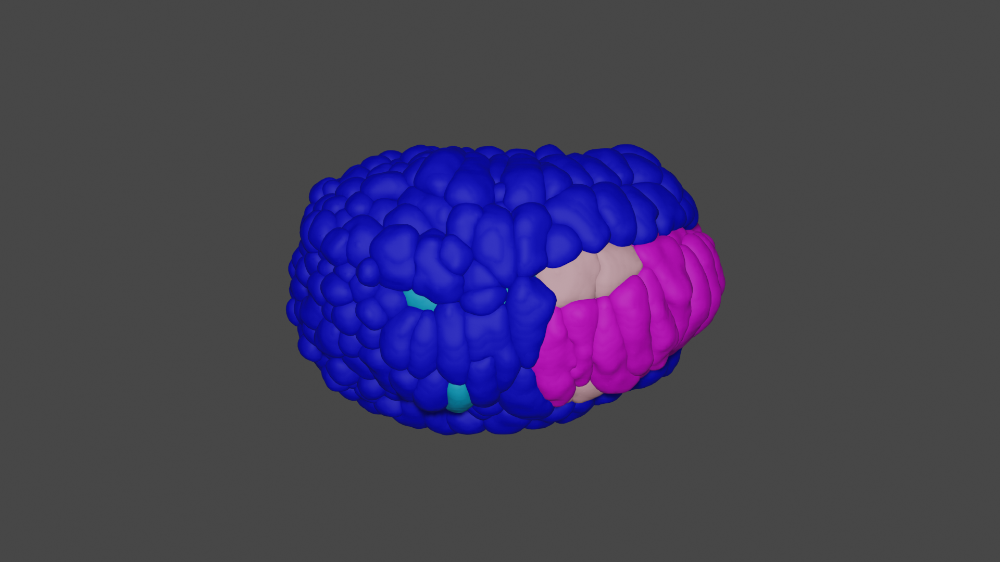
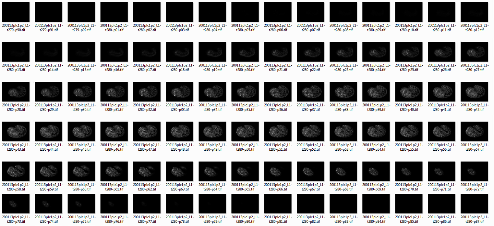
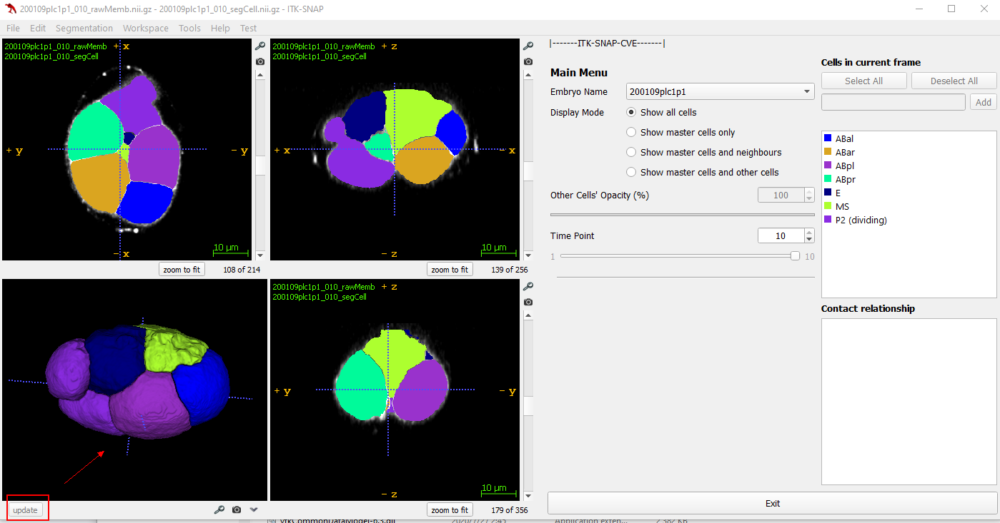

# CMap Segmentation Manual

# 1. Introduction 
CMap is a new computational pipeline for segmenting *C. elegans* time-lapse embryos. It uses the nucleus information from StarryNite to improve the cell membrane segmentation results. CMap can segment the *C. elegans* embryo at the late 550-cell stage, while CShaper can only do it at the 350-cell stage. **This tutorial shows how to run CMap online using the Colab cloud computing service by Google, which makes it accessible to users worldwide**.

<p align="center"> </p>


## 1.1 CMapCode Link (Complete Version for Local Running, NOT for Online Running)

This folder is for researchers who know how to use python and jupyter notebook. **If you don’t know python, please go to Section *2.1 Run the Program Online via Google Colab (Recommended Way)* **.

The CMapCode.zip file contains 5 jupyter notebooks, the related python modules and the example data for running the program: https://portland-my.sharepoint.com/:u:/g/personal/zelinli6-c_my_cityu_edu_hk/Ec3zXvxQnLBJrNLFWcSfaCMBME_JNPYhJWIUCgQfIYmPPA?e=Ma8ben ! **If you know python, please download the file, go to Section *2.2 Run the Program on Your PC (Linux) with Python Environment* and run the jupyter notebooks in order from 1 to 5**.


# 2. Segmentation Program Tutorials
We provide two ways (online or local) to run CMap to segment and generate visualized 3D GUI data for your own time-lapse fluorescent images.

<p align="center"> </p>


## 2.1 Run the Program Online via Google Colab (Recommended Way)
Google Colab is an online jupyter notebook service provided by Google for scientific research.  CMap colab program: https://colab.research.google.com/drive/13F2R7HzMra8_CWsaD3FYNnt-GdzD1Tpy?usp=sharing ! (Optional)You can learn more about it at https://colab.research.google.com/ .

You don’t need to know python or jupyter notebook to use this program. If you want to run it on your own data, you just need to prepare your tifR images and the CD{embryo_name}.csv files for each embryo. However, the free google colab has limited computational resources. **If your maximum time point of your embryo is more than 20, I strongly suggest you to upgrade to Google Colab Pro for longer running time and faster shape analysis**.

* Youtube Google Colab tutorial video for a quick start! https://youtu.be/lQyx5Z2wY90 ! 

### >>>>====Colab Running Steps====<<<<
* Download and upload or copy the Folder CMapCode to your google drive root directory. https://drive.google.com/drive/folders/1NWAxXAQuFf9sNafWkvGYNslUAQjAszbW?usp=sharing .

<p align="center"> </p>

  
  * The folder tree is
    ```
    ├── Your google drive root
    │   ├── CMapCode
    |   │   ├── ckpts
    |   │   │   ├── CMap_model_epoch_50.pth
    |   │   ├── data
    |   │   │   ├── **.py
    |   │   ├── dataset
    |   |   │   ├── run
    |   |   |   │   ├── {embryo name}
    |   |   |   |   │   ├── tifR
    |   |   |   |   |   │   ├── {embryo name}_L1-t{time point}-p{slice number index}.tif
    |   |   │   ├── CDFiles
    |   |   |   │   ├── {embryo name}.csv
    |   |   │   ├── CellFate.xls
    |   |   │   ├── name_dictionary_cmap.csv
    |   |   │   ├── name_dictionary.csv
    |   |   │   ├── number_dictionary.csv
    |   |   │   ├── tissue_wise_name_dictionary.csv
    |   │   ├── experiment
    |   │   │   ├── TRAIN_TEST.yaml
    |   │   ├── models
    |   │   │   ├── *.py
    |   │   ├── utils
    |   │   │   ├── *.py
    ```
  * The example membrane image data is saved in the folder *your google drive root/CMapCode/dataset/run/{embryo name}/tifR/{embryo name}_L1-t{time point}-p{slice number index}.tif* and the CD file with nucleus location labeling is saved at *CMapCode/dataset/run/CDFiles/{embryo name}.csv*. 
  * **Please upload your own data on your *your google drive root/CMapCode/dataset/run* following the folder structure**.
  
* Open the CMap colab jupyter, and save a program copy (https://colab.research.google.com/drive/13F2R7HzMra8_CWsaD3FYNnt-GdzD1Tpy?usp=sharing) to your own colab to run. 

  <p align="center"> </p>

  
  * Follow the instruction (strongly recommend you to watch the tutorial video [Link](https://youtu.be/lQyx5Z2wY90)), and click and run the block one by one.
    <p align="center"> </p>
  
  * Download the Cell-wise and Fate-wise GUI data folders at *your google drive root/CMapCode/GUIDataCellWise* and *your google drive root/CMapCode/GUIDataFateWise* . Open the folder with our [ITK-CVE-SNAP (NOT ITK-SNAP)](https://portland-my.sharepoint.com/:u:/g/personal/zelinli6-c_my_cityu_edu_hk/EYqGjfoFp8NDjoRLdhEUBKMBPVytBpQNKNBqRN-MH_2F9g)!

## 2.2 Run the Program on Your PC (Linux) with Python Environment

If you are running this, you should know how to use python and jupyter notebook. It is also very easy and kind for beginners! You may spend less than one week to learn python and jupyter notebook, then you can start preprocessing, training, running, shape analyzing, and GUI visualization data generation on your own linux computer! The 5 jupyter notebooks, the related python modules and the running example data are zipped in the CMapCode.zip : https://portland-my.sharepoint.com/:u:/g/personal/zelinli6-c_my_cityu_edu_hk/Ec3zXvxQnLBJrNLFWcSfaCMBME_JNPYhJWIUCgQfIYmPPA?e=Ma8ben !

* Youtube PC (linux) tutorial video for a quick start! https://youtu.be/h2-89Fr2CAQ ! 

* If you have your own 3D labeled data and going to train them, please generate and group the data as following folder structure. All these nii.gz files are composed of 2D slices and CD files. All the code could be found in the preprocessing part! You need to group the training data with your own python script because you need to label the SegCell with your own data.
  ```
  ├── Your project root directory (code, data, and temporary output)
  │   ├── ckpts
  |   │   │   ├── {network name}
  |   |   │   │   ├── ...
  │   ├── dataset
  |   │   ├── training
  |   |   │   ├── {embryo name}
  |   |   |   │   ├── PklFile
  |   |   |   |   │   ├── {embryo name}_{time point}.pkl
  |   |   |   │   ├── RawMemb
  |   |   |   |   │   ├── {embryo name}_{time point}_rawMemb.nii.gz
  |   |   |   │   ├── RawNuc
  |   |   |   |   │   ├── {embryo name}_{time point}_rawNuc.nii.gz
  |   |   |   │   ├── SegCell
  |   |   |   |   │   ├── {embryo name}_{time point}_segCell.nii.gz
  |   |   |   │   ├── SegMemb
  |   |   |   |   │   ├── {embryo name}_{time point}_segMemb.nii.gz
  |   |   |   │   ├── SegNuc
  |   |   |   |   │   ├── {embryo name}_{time point}_segNuc.nii.gz
  ...
  
  ```
* **If you are running the program on your own data, no training is needed**, all you need to do is to prepare your tifR images and the corresponding CD{embryo_name}.csv files. You should replace the example data with your own data following the data format and folder structure.


### >>>>====Jupyter Notebook Running Steps====<<<<

The steps are explained in the jupyter notebook. You run it one by one and change some parameters, then you could see the results. I use 30 processes in the local tutorial, which could be faster but use large memory, which helps in the shape analysis step. Shape analyzing costs a lot of time, so please be patient if you use a small number of processes.

* The root folder structure is as follows (complete version).
  ```
  ├── CMapCode
  │   ├── ckpts
  |   │   ├── TRAIN_TEST (Output of 2_Train.ipynb)
  |   |   │   ├── cfg.yaml
  |   |   │   ├── model_epoch_{epoch index}.pth
  │   │   ├── CMap_model_epoch_50.pth
  │   ├── data
  │   │   ├── **.py
  │   ├── dataset
  |   │   ├── training
  |   |   │   ├── ** (Input of 2_Train.ipynb)
  |   │   ├── run
  |   |   │   ├── {embryo name}
  |   |   |   │   ├── PklFile (Output of 1_DataProcess.ipynb)
  |   |   |   |   │   ├── {embryo name}_{time point}.pkl
  |   |   |   │   ├── RawMemb (Output of 1_DataProcess.ipynb)
  |   |   |   |   │   ├── {embryo name}_{time point}_rawMemb.nii.gz
  |   |   |   │   ├── SegCell (Output of 3_Run_segmentation.ipynb)
  |   |   |   |   │   ├── {embryo name}_{time point}_segCell.nii.gz
  |   |   |   │   ├── SegCellDivisionCells (Output of 3_Run_segmentation.ipynb)
  |   |   |   |   │   ├── {embryo name}_{time point}_segCell.nii.gz
  |   |   |   │   ├── SegMemb (Output of 3_Run_segmentation.ipynb)
  |   |   |   |   │   ├── {embryo name}_{time point}_segMemb.nii.gz
  |   |   |   │   ├── SegNuc (Output of 1_DataProcess.ipynb)
  |   |   |   |   │   ├── {embryo name}_{time point}-segNuc.nii.gz
  |   |   |   │   ├── tifR (Raw Input of 1_DataProcess.ipynb)
  |   |   |   |   │   ├── {embryo name}_L1-t{time point}-p{slice number index}.tif
  |   │   ├── CDFiles
  |   |   │   ├── {embryo name}.csv
  |   │   ├── CellFate.xls
  |   │   ├── name_dictionary_cmap.csv
  |   │   ├── name_dictionary.csv
  |   │   ├── number_dictionary.csv
  |   │   ├── tissue_wise_name_dictionary.csv
  |   │   ├── experiment
  |   │   │   ├── TRAIN_TEST.yaml
  |   │   ├── models
  |   │   │   ├── *.py
  |   │   ├── utils
  |   │   │   ├── *.py
  |   │   ├── logs (Output of 2_Train.ipynb or 3_Run_segmentation.ipynb)
  |   │   │   ├── TRAIN_TEST_train.txt 
  |   │   │   ├── TRAIN_TEST_run.txt
  │   ├── middle_output
  |   │   ├── {embryo name} (Output of 4_Run_cell_shape_analysis.ipynb)
  |   |   │   ├── {embryo name}_{time point}_segCell_contact.txt
  |   |   │   ├── {embryo name}_{time point}_segCell_surface.txt
  |   |   │   ├── {embryo name}_{time point}_segCell_volume.txt
  |   │   ├── GUIDataFateWise (Output of 5_GUIData_visualization.ipynb)
  |   |   │   ├── {embryo name}
  |   |   |   │   ├── **
  |   |   |   ├── name_dictionary.csv
  |   │   ├── GUIDataTissueWise (Output of 5_GUIData_visualization.ipynb)
  |   |   │   ├── **
  |   |   ├──NucLocFile (Output of 4_Run_cell_shape_analysis.ipynb)
  |   |   │   ├── {embryo name}
  |   |   |   │   ├── {embryo name}_{time point}_nucLoc.csv
  |   |   ├──statistics (Output of 4_Run_cell_shape_analysis.ipynb)
  |   |   │   ├── {embryo name}
  |   |   |   │   ├── {embryo name}_contact.csv
  |   |   |   │   ├── {embryo name}_surface.csv
  |   |   |   │   ├── {embryo name}_volume.csv
  │   ├── 1_DataProcess.ipynb
  │   ├── 2_Train.ipynb
  │   ├── 3_Run_segmentation.ipynb
  │   ├── 4_Run_cell_shape_analysis.ipynb
  │   ├── 5_GUIData_visualization.ipynb
  │   ├── train.py
  │   ├── test.py
  │   ├── environment.yml
  ```

* You might encounter some issues with setting up the conda environment. You need to fix them by removing conflicting packages and searching on Google.

* Run the five jupyter notebooks in sequence. The instructions and the steps are shown in the notebooks.
  <p align="center"> </p>

# 3. Visualization Software

## 3.1 Novel 3D Visualized GUI data and ITK-CVE-SNAP Software (NOT ITK-SNAP)

* Short tutorial video: https://youtu.be/XhhtBp1kBAo !
* The example GUI Data, GUIDataCellWise (you get from the *2.1 Run the Program Online via Google Colab (Recommended Way)*), is here: https://drive.google.com/file/d/1eWIOBa5Cr_NTFi7htLCAoGJ3-lDsAoVf/view?usp=sharing !
* The example GUIDataTissueWise (you get from the *2.1 Run the Program Online via Google Colab (Recommended Way)*), is here: https://drive.google.com/file/d/1nampvmoSpqhRHptAHZtIUDtbOANMT301/view?usp=sharing !

  <p align="center"> </p>


* ITK-CVE-SNAP software link: https://drive.google.com/drive/folders/1a9LSzUdf98dP0D2Tggxmx55mCymXtusr?usp=sharing ！

## 1.2 Original ITK-SNAP Illustration (NOT ITK-CVE-SNAP, Optional)

* Download link: http://www.itksnap.org/pmwiki/pmwiki.php?n=Downloads.SNAP4  ; you can also search the google to download and install it.
* Short tutorial video:  https://youtu.be/VjA354giVhM !
* This is just a optional part for your better understanding in using visualization software on your raw 3D images and the 3D segmented volumes.

  <p align="center"> </p>


# Acknowledgement

* The main code project structure is founded by Dr. Jianfeng CAO. Zelin LI makes cell segmentation and shape analysis more accurate with acceptable biases. 
* This code project is supported by  Professor Chao TANG, Professor Zhongying ZHAO and Professor Hong YAN. 
* The validation process partly uses the code of [*CShaper*](https://github.com/cao13jf/CShaper).
* Some parts of this repository are referred to [BraTS-DMFNet](https://github.com/China-LiuXiaopeng/BraTS-DMFNet), e.g., the implementation of the model.


